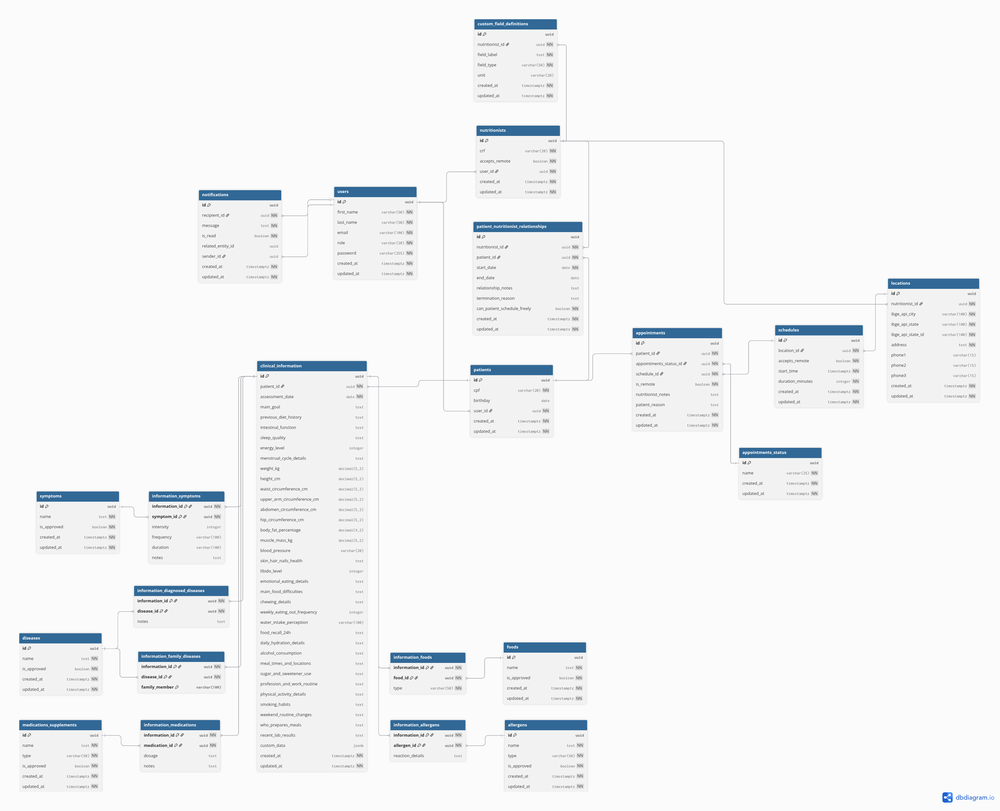

# NutriApp 🍏

## A ponte direta para uma vida mais saudável.

**NutriApp** é uma plataforma inovadora que revoluciona a interação entre nutricionistas e pacientes, eliminando barreiras e fortalecendo o vínculo terapêutico. Nossa missão é remover a necessidade de intermediários, como secretárias, para criar um canal de comunicação direto, ágil e focado no que realmente importa: **a sua jornada de bem-estar.**

Para o paciente, oferecemos autonomia e acesso sem precedentes. Para o nutricionista, proporcionamos uma ferramenta poderosa de gestão e um contato mais próximo e humanizado com quem confia em seu trabalho.

---

### ✨ Principais Funcionalidades

#### Para Pacientes 🙋‍♀️🙋‍♂️

Capacitamos você a tomar o controle da sua saúde com ferramentas intuitivas e acesso direto ao seu nutricionista.

- 🗓️ **Agenda na Palma da Mão:** Marque, remarque ou visualize suas consultas com total autonomia, 24 horas por dia, sem telefonemas ou espera.
- 📊 **Seu Progresso, Sempre com Você:** Tenha acesso instantâneo a todo o seu histórico, planos alimentares, avaliações antropométricas e metas, diretamente no app.
- 🔔 **Notificações Inteligentes:** Receba lembretes de consultas, confirmações e novas mensagens do seu nutricionista em tempo real.
- 📄 **Documentos Organizados:** Exporte seus planos e avaliações em formato PDF com um único clique, perfeito para imprimir ou compartilhar.
- 💬 **Comunicação Simplificada:** Um canal direto para tirar dúvidas e manter o contato com seu profissional de saúde.

#### Para Nutricionistas 👨‍⚕️👩‍⚕️

Otimize sua rotina, fidelize seus pacientes e eleve o nível do seu atendimento, sem a necessidade de uma secretária.

- 📅 **Gestão de Agenda Inteligente:** Organize seus horários de forma flexível, gerencie múltiplos locais de atendimento e tenha uma visão clara da sua semana de trabalho.
- 👥 **Contato Próximo e Contínuo:** Fortaleça o vínculo terapêutico com seus pacientes, oferecendo um acompanhamento mais presente e eficaz.
- 🔔 **Notificações em Tempo Real:** Seja avisado instantaneamente quando um paciente marcar, cancelar ou confirmar uma consulta, mantendo você sempre no controle.
- 📈 **Anamnese Digital e Completa:** Crie e gerencie fichas de avaliação detalhadas, com campos normalizados e a possibilidade de adicionar campos personalizados para um atendimento único.
- ✍️ **Planos Alimentares Digitais:** Elabore e envie os planos alimentares diretamente pela plataforma, com a opção de exportar em PDF para o paciente.
- 🔍 **Busca e Gestão de Pacientes:** Encontre facilmente qualquer paciente em sua base, visualize o histórico e a data da última consulta com agilidade.

---

### 🚀 Tecnologias Utilizadas

Este projeto foi construído com as tecnologias mais modernas e robustas do mercado, garantindo performance, segurança e escalabilidade.

- **Backend:**
  - Java 21
  - Spring Boot 3
  - Spring Security & JWT
  - JPA / Hibernate
  - PostgreSQL
  - WebSockets (para notificações em tempo real)
  - Maven

- **Frontend:**
  - React
  - TypeScript
  - Redux Toolkit
  - Material-UI (MUI)
  - Vite
  - Axios

---

### 🛠️ Como Executar o Projeto (Exemplo)

Para configurar o ambiente de desenvolvimento local, siga os passos abaixo:

1.  **Clone o repositório:**
    ```bash
    git clone [https://github.com/seu-usuario/nutriApp.git](https://github.com/seu-usuario/nutriApp.git)
    ```
2.  **Configure o Backend:**
    - Navegue até a pasta `backend`.
    - Configure suas variáveis de ambiente (`.env`) com as credenciais do banco de dados.
    - Execute o projeto: `mvn spring-boot:run`
3.  **Configure o Frontend:**
    - Navegue até a pasta `frontend`.
    - Instale as dependências: `npm install`
    - Inicie o servidor de desenvolvimento: `npm run dev`

---

### 🎨 Visualização

|                     Design do Banco de Dados Atual                     |
|:----------------------------------------------------------------------:|
|             |

---

### 🎨 Documentação

Esta documentação descreve os endpoints para gerenciar os horários de disponibilidade (`Schedules`) e as consultas (`Appointments`) associadas.

**Autenticação:** Todas as rotas exigem um Bearer Token JWT válido no cabeçalho `Authorization`.

<br>

<details>
  <summary><strong>Buscar Agenda de um Nutricionista (Visão do Paciente)</strong> - <code>GET /nutritionists/{nutritionistId}/schedules</code></summary>
  
  <br>
  
  Busca os horários disponíveis e já agendados de um nutricionista específico dentro de um intervalo de datas.

  - **Autorização:** `ROLE_PATIENT`

  ---

  #### Parâmetros da URL

  | Parâmetro | Tipo | Descrição |
  | :--- | :--- | :--- |
  | `nutritionistId` | `UUID` | O ID do nutricionista cuja agenda será buscada. |

  ---

  #### Query Parameters

  | Parâmetro | Tipo | Descrição | Obrigatório |
  | :--- | :--- | :--- | :--- |
  | `startDate` | `LocalDate` | Data de início do filtro (formato: `YYYY-MM-DD`). | Não |
  | `endDate` | `LocalDate` | Data de fim do filtro (formato: `YYYY-MM-DD`). | Não |

  ---

  #### Resposta de Sucesso (Success Response)

  - **Código:** `200 OK`
  - **Corpo da Resposta:** `Set<OwnScheduleDTO>`

  ```json
  [
      {
          "id": "a1b2c3d4-e5f6-7890-1234-567890abcdef",
          "startTime": "2025-08-01T10:00:00",
          "durationMinutes": 30,
          "type": "SCHEDULE",
          "patient": null,
          "status": "DISPONIVEL",
          "location": {
              "id": "l1o2c3a4-t5i6-o7n8-9012-3456789abcde",
              "address": "Rua das Flores, 123 - Sala 4 - São Paulo, SP",
              "phone1": "11987654321"
          }
      },
      {
          "id": "f0e9d8c7-b6a5-4321-fedc-ba9876543210",
          "startTime": "2025-08-01T11:00:00",
          "durationMinutes": 30,
          "type": "APPOINTMENT",
          "patient": {
              "id": "p1a2t3i4-e5n6-t7e8-9012-3456789abcde",
              "name": "Carlos Silva",
              "email": "carlos@email.com"
          },
          "status": "CONFIRMADO",
          "location": {
              "id": "l1o2c3a4-t5i6-o7n8-9012-3456789abcde",
              "address": "Rua das Flores, 123 - Sala 4 - São Paulo, SP",
              "phone1": "11987654321"
          }
      }
  ]
  ```
</details>

<details>
  <summary><strong>Buscar Própria Agenda (Visão do Nutricionista)</strong> - <code>GET /nutritionists/me/schedules</code></summary>
  
  <br>
  
  Busca os próprios horários de disponibilidade e consultas do nutricionista autenticado.

  - **Autorização:** `ROLE_NUTRITIONIST`

  ---

  #### Query Parameters

  | Parâmetro | Tipo | Descrição | Obrigatório |
  | :--- | :--- | :--- | :--- |
  | `startDate` | `LocalDate` | Data de início do filtro (formato: `YYYY-MM-DD`). | Não |
  | `endDate` | `LocalDate` | Data de fim do filtro (formato: `YYYY-MM-DD`). | Não |

  ---

  #### Resposta de Sucesso (Success Response)

  - **Código:** `200 OK`
  - **Corpo da Resposta:** `Set<OwnScheduleDTO>` (mesma estrutura do endpoint 1).

</details>

<details>
  <summary><strong>Criar Horário de Disponibilidade</strong> - <code>POST /nutritionists/me/schedules/{locationId}</code></summary>
  
  <br>
  
  Cria um novo horário de disponibilidade (`Schedule`) para o nutricionista autenticado em um local de atendimento específico.

  - **Autorização:** `ROLE_NUTRITIONIST`

  ---

  #### Parâmetros da URL

  | Parâmetro | Tipo | Descrição |
  | :--- | :--- | :--- |
  | `locationId` | `UUID` | O ID do local de atendimento onde a disponibilidade será criada. |

  ---

  #### Corpo da Requisição (Request Body)

  - **Content-Type:** `application/json`

  ```json
  {
      "startLocalDateTime": {
          "year": 2025,
          "month": 8,
          "day": 4,
          "hour": 14,
          "minute": 30
      },
      "durationMinutes": 30
  }
  ```

  ---

  #### Resposta de Sucesso (Success Response)

  - **Código:** `201 CREATED`
  - **Corpo da Resposta:** `OwnScheduleDTO`

  ```json
  {
      "id": "a1b2c3d4-e5f6-7890-1234-567890abcdef",
      "startTime": "2025-08-04T14:30:00",
      "durationMinutes": 30,
      "type": "SCHEDULE",
      "patient": null,
      "status": "DISPONIVEL",
      "location": {
          "id": "l1o2c3a4-t5i6-o7n8-9012-3456789abcde",
          "address": "Av. Principal, 789 - Centro - Rio de Janeiro, RJ",
          "phone1": "21912345678"
      }
  }
  ```
</details>

<details>
  <summary><strong>Deletar Horário de Disponibilidade</strong> - <code>DELETE /nutritionists/me/schedules/{scheduleId}</code></summary>
  
  <br>
  
  Exclui um horário de disponibilidade (`Schedule`) da agenda do nutricionista. Apenas horários que não possuem uma consulta vinculada podem ser excluídos.

  - **Autorização:** `ROLE_NUTRITIONIST`

  ---

  #### Parâmetros da URL

  | Parâmetro | Tipo | Descrição |
  | :--- | :--- | :--- |
  | `scheduleId` | `UUID` | O ID do horário de disponibilidade (`Schedule`) a ser deletado. |

  ---

  #### Resposta de Sucesso (Success Response)

  - **Código:** `204 No Content`
  - **Corpo da Resposta:** Vazio.

</details>

### 🤝 Como Contribuir

Contribuições são o que tornam a comunidade open-source um lugar incrível para aprender, inspirar e criar. Qualquer contribuição que você fizer será **muito bem-vinda**.

1.  Faça um Fork do projeto
2.  Crie sua Feature Branch (`git checkout -b feature/AmazingFeature`)
3.  Faça o Commit das suas alterações (`git commit -m 'Add some AmazingFeature'`)
4.  Faça o Push para a Branch (`git push origin feature/AmazingFeature`)
5.  Abra um Pull Request

---

### 📄 Licença

Distribuído sob a licença MIT. Veja `LICENSE` para mais informações.
